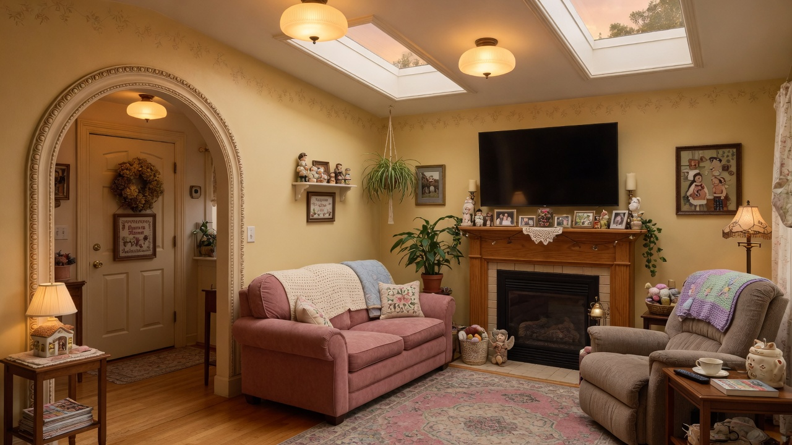
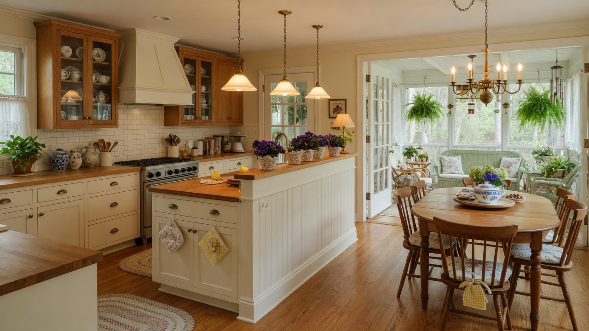
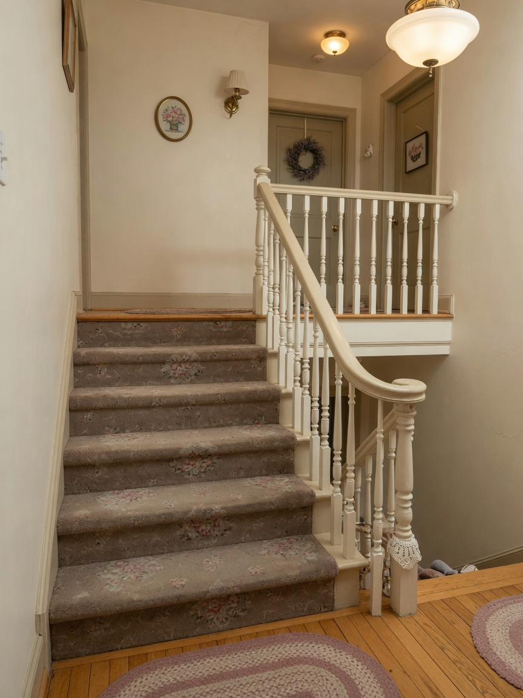

# Forever Home

A version-controlled design project for Branden and Renn's future home.

The goal is not merely to draw a house. It is to design a warm, practical, deeply personal home that supports the life and relationship intended to exist inside it.

## Design direction

**Whimsical grandma home**: cozy, collected, welcoming, gently eccentric, and full of character without sacrificing modern function.

The home should feel:

- emotionally safe and restful
- warm rather than sterile
- lived-in rather than staged
- personal rather than trend-driven
- easy to maintain and comfortable to age in

## Current project brief

- Target size: approximately **1,500 sq ft** above-grade living
- Raised-ranch / split organization: lower + main + upper (half-story stairs)
- Minimum **three bedrooms** in a **connected suite** (hotel-style internal doors)
- **Renn's boutique walk-in** and **Branden's hybrid bedroom/office**
- Open **kitchen + dining** with **three-season porch** from dining
- Shared spaces designed around conversation, comfort, creativity, and everyday rituals

## Single source of truth (start here)

| Need | Document |
|---|---|
| Vision & aesthetic | [Vision/Design_Philosophy.md](Vision/Design_Philosophy.md) |
| Room list & adjacencies | [Requirements/Room_Program.md](Requirements/Room_Program.md) |
| Building form & levels | [Architecture/Building_Program.md](Architecture/Building_Program.md) |
| **Kitchen / dining / porch Revit specs** | [Architecture/Kitchen_Dining_Porch_Specs.md](Architecture/Kitchen_Dining_Porch_Specs.md) |
| **Main floor schematic dimensions** | [Architecture/Main_Floor_Schematic.md](Architecture/Main_Floor_Schematic.md) |
| **Half-story stairs** | [Architecture/Stairs_Half_Story.md](Architecture/Stairs_Half_Story.md) |
| **Material & finish list** | [Architecture/Material_Schedule.md](Architecture/Material_Schedule.md) |
| Flooring options (carpet uncertainty) | [Interior/Flooring_Options.md](Interior/Flooring_Options.md) |
| Living room concept | [Interior/Living_Room.md](Interior/Living_Room.md) |
| Kitchen/dining concept | [Interior/Kitchen_Dining.md](Interior/Kitchen_Dining.md) |
| Owner decisions log | [Decisions/Design_Decisions.md](Decisions/Design_Decisions.md) |
| Revit modeling guide | [Revit/README.md](Revit/README.md) |
| Concept renders | [Renderings/README.md](Renderings/README.md) |

### Concept renders

| Image | Description |
|---|---|
|  | Living room |
|  | Kitchen, dining, three-season porch |
|  | Half-story carpeted stairs |

*(If images do not preview on GitHub, open files under [`Renderings/`](Renderings/).)*

## Locked schematic highlights

### Open kitchen → dining → porch

| Zone | Size | Notes |
|---|---|---|
| Kitchen | 14'-0" × 12'-0" (168 sf) | Island 8'×4', 30" range, 42–48" aisles, half wall 42" high |
| Dining | 11'-0" × 10'-0" (110 sf) | Continuous open volume; French doors to porch |
| Three-season porch | 12'-0" × 10'-0" (120 sf) | Semi-conditioned; exclude from 1,500 sf living unless upgraded |

### Half-story stairs

- **5–7 steps** per run (preferred **6 risers @ 7-1/4"** = 43-1/2" rise)
- Treads **10-1/2"**, clear width **36"+**, closed risers
- **Carpeted treads** baseline; wood + runner alternate
- Railing: **traditional turned balusters**, oval handrail @ 36", modest box newels

### Materials (default model)

Warm cream shaker cabinets, aged brass, warm quartz, subway splash, engineered oak (or LVP) main floors, stair carpet, 2700K layered lighting. Full codes: [Architecture/Material_Schedule.md](Architecture/Material_Schedule.md).

## Repository structure

```text
Forever_home/
├── README.md                 ← you are here (project index)
├── Vision/                   ← design philosophy
├── Requirements/             ← room program
├── Architecture/             ← Revit-ready specs, stairs, materials, schematic
├── Interior/                 ← room concepts, flooring options
├── Decisions/                ← design decision log
├── Renderings/               ← concept images
├── Revit/                    ← modeling guide (+ future .rvt)
├── Systems/                  ← MEP, wiring
├── Accessibility/
├── Landscape/
├── Budget/
├── Maintenance/
├── Exports/                  ← future sheet PDFs/DWG
└── …
```

## Working principle

> Every room should earn its place.

A space belongs in the plan because it supports daily life, individual identity, the relationship, hospitality, future flexibility, or long-term comfort.

## Roadmap

- [x] Establish design philosophy
- [x] Record initial room requirements
- [x] Living room concept + render
- [x] Open kitchen, dining, three-season porch specs + renders
- [x] Half-story stair specs + render
- [x] Material schedule + main-floor schematic for Revit
- [ ] Gather Renn's saved preferences
- [ ] Draft schematic floor plans in Revit
- [ ] Build massing model
- [ ] Coordinate structure / MEP
- [ ] Refine accessibility, energy, and construction practicality

## Disclaimer

Documents in this repository are **owner-development design intent**. They are not permit-ready or engineered construction documents until reviewed by licensed professionals and local authorities.
